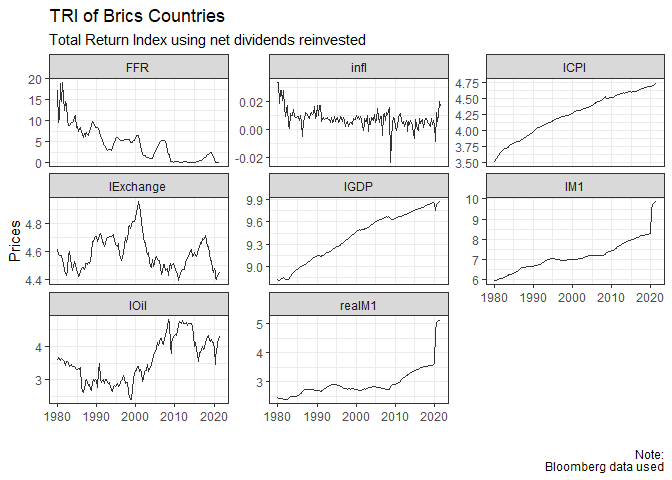

``` r
library(pacman)
pacman::p_load(fredr, tidyverse, lubridate, tsibble, dplyr, tseries, grid,gridExtra, sparsevar, tsDyn,vars)
```

# Johansen’s Methodology for Modeling Cointegration

1.  Select the specification of the deterministic component. Here the
    **Φ**<sub>*t*</sub>**D**<sub>*t*</sub> = **μ**<sub>*t*</sub> = **μ**<sub>0</sub> + **μ**<sub>1</sub>*t*
    term contains all deterministic parts, i.e. constants and trends.
2.  Pre-test the variables to conclude that they are (or may be) *I*(1).
3.  Estimate the unrestricted VAR in levels and check the adequacy of
    the model specification.
4.  Impose the number of cointegrating relationships *r* and execute
    normalization as necessary.
5.  Estimate the resulting (reduced-rank) cointegrated VECM, interpret
    the economic dynamics of the model, and test further hypothesized
    restrictions.

## 1. Select the specification of the deterministic component.

``` r
df1_tidy <- df1 |> dplyr::select(date,FFR, lCPI, lGDP, lM1, lExchange, lOil, infl, realM1) |> pivot_longer(cols = c(FFR, lCPI, lGDP, lM1, lExchange, lOil, infl,realM1), names_to = "Variable", values_to = "Value") |> arrange(date)

gggg <- df1_tidy |> ggplot() +
    geom_line(aes(x = date, y = Value), alpha = 0.8, 
    size = 0.5) + 
    theme_bw() + theme(legend.position = "none") + labs(x = "", 
    y = "Prices", title = "TRI of Brics Countries", subtitle = "Total Return Index using net dividends reinvested", 
    caption = "Note:\nBloomberg data used") +
    facet_wrap(~Variable, scales = "free_y") 
    
gggg
```



## 2. Pre-test the variables to conclude that they are (or may be) *I*(1)

### 2.1.Augmented Dickey-Fuller (ADF) test for unit roots

``` r
adf_interestrate_tr <- ur.df(interestrate_tr, type = "trend", selectlags = c("AIC")) #fail to reject null of no unit root
adf_price_tr <- ur.df(price_tr, type = "trend", selectlags = c("AIC")) #fail to reject null of no unit root
adf_realGDP_tr <- ur.df(realGDP_tr, type = "trend", selectlags = c("AIC")) # fail ...
adf_oilprice_tr <- ur.df(oilprice_tr, type = "trend", selectlags = c("AIC")) #
adf_interestrate_tr <- ur.df(interestrate_tr, type = "trend", selectlags = c("AIC"))
adf_monetaryaggregate_tr  <- ur.df(monetaryaggregate_tr, type = "trend", selectlags = c("AIC"))
```

### 2.2.Augmented Dickey-Fuller (ADF) test for order of integration

``` r
adf_D_interestrate_tr <- ur.df(D_interestrate_tr, selectlags = c("AIC")) #I(1)
adf_D_price_tr <- ur.df(D_price_tr, selectlags = c("AIC")) #fail to reject null of no unit root only at the 1% sign level #I(2)
adf_D_realGDP_trr <- ur.df(D_realGDP_tr, selectlags = c("AIC")) #I(1)
adf_D_exchangerate_tr <- ur.df(D_exchangerate_tr, selectlags = c("AIC")) #I(1)
adf_D_oilprice_tr <- ur.df(D_oilprice_tr, selectlags = c("AIC")) #I(1)
adf_D_monetaryaggregate_tr <- ur.df(D_monetaryaggregate_tr, selectlags = c("AIC")) #fail to reject null of no unit root only at the 1% sign level

## Now lets deal with the problem of the monetary aggregate I(2) be transforming it to the real monetary aggregate (mt - pt) and to inflation (change in price)

adf_real_monetaryaggregate_tr <- ur.df(real_monetaryaggregate_tr, type = "trend", selectlags = c("AIC")) #fail to reject null of no unit root

adf_D_real_montaryaggregate_tr <- ur.df(D_real_monetaryaggregate_tr , selectlags = c("AIC")) #reject the null, Therefore is I(1)

adf_inflation_tr <- ur.df(inflation_tr,selectlags = c("AIC")) #fail to reject the null of no unit root

D_adf_inflation_tr <- ur.df(D_inflation_tr,selectlags = c("AIC")) #reject the null. Thus inflation is I(1)
```

## 3. Estimate the unrestricted VAR in levels and check the adequacy of the model specification.

``` r
VAR1 <- cbind(real_monetaryaggregate_tr, interestrate_tr, realGDP_tr, inflation_tr, exchangerate_tr, oilprice_tr)
colnames(VAR1) <- cbind("RealMonetaryAggregate", "InterestRate", "RealGDP", "Inflation", "ExchangeRate", "OilPrice")
#In the same order as the A matrix


VAR2 <- cbind(realGDP_tr, oilprice_tr, interestrate_tr, inflation_tr,exchangerate_tr ,real_monetaryaggregate_tr)
#In a similar order to the cointegration analysis of the restricted system
```

### 3.1.Determine the order of lag

``` r
infocrit <- VARselect(VAR2, lag.max = 4, type = "trend") ##Similar results as in the paper. Lag length of 2
```

### 3.2.Check the model specification adequacy of the estimated unrestricted VAR in levels

A critical point is to test that errors are white noise. The Johansen
Method is a ML method, i.e. limiting distributions are derived assuming
normal errors: 1.Robust to some deviations: some non-normality,
heteroscedasticity 2.Requires: i.i.d. errors with finite variance
3.Hence the following is unacceptable: autocorrelated residuals,
time-varying parameters, structural breaks

``` r
VAR_unrestricted <- VAR(VAR2, p = 2, type = "trend")

roots_stability <- roots(VAR_unrestricted) ##Shows eigenvalues corresponding to stability
```

``` r
 varUR.serial <- serial.test(VAR_unrestricted, lags.pt = 17) ## Fail to reject null of multivariate serial correlation


 varUR.serial2 <- serial.test(VAR_unrestricted, type = "BG", lags.bg = 16)  ## Fail to reject null of multivariate serial correlation
 
 
 varUR.arch <- arch.test(VAR_unrestricted, lags.multi = 4,multivariate.only = F) ##Evidence of heteroskedasticity. Look individually
 
 varUR.norm <- normality.test(VAR_unrestricted, multivariate.only = F) ## Evidence of non-normal errors. Look individually

 
 #plot(varUR.serial)

reccusum_test <- stability(VAR_unrestricted,type = "Rec-CUSUM") #In time series analysis, the CUSUM statistics use the sequence of residual deviations from a model to indicate whether the autoregressive model is misspecified.

 plot(reccusum_test)
```


``` r
fluctuation_test <- stability(VAR_unrestricted,type = "fluctuation") ## Test for unstable parameter fluctuations. Both these

 plot(fluctuation_test)
```


## 4.Impose the number of cointegrating relationships *r* and execute normalization as necessary.

### 4.1. Determine the number of cointegrating relationships

``` r
Johansen_trace <- ca.jo(VAR2, type="trace", K=2, ecdet=c("trend"), spec="longrun")

# test stat < CV where r <=2 : reject null of no cointegrating relationships

Johansen_eig<- ca.jo(VAR2, type="eigen",ecdet=c("trend") , K=2, spec="longrun")

# test stat > CV for r=0 and r <=1. Hence, indicative of 2 cointegrating relationships. Not the same as determined by @cologni2008

summary(Johansen_eig)
```

    ## 
    ## ###################### 
    ## # Johansen-Procedure # 
    ## ###################### 
    ## 
    ## Test type: maximal eigenvalue statistic (lambda max) , with linear trend in cointegration 
    ## 
    ## Eigenvalues (lambda):
    ## [1]  4.631752e-01  3.704541e-01  2.047458e-01  1.023403e-01  7.418402e-02
    ## [6]  3.460448e-02 -2.531053e-17
    ## 
    ## Values of teststatistic and critical values of test:
    ## 
    ##           test 10pct  5pct  1pct
    ## r <= 5 |  3.31 10.49 12.25 16.26
    ## r <= 4 |  7.25 16.85 18.96 23.65
    ## r <= 3 | 10.15 23.11 25.54 30.34
    ## r <= 2 | 21.53 29.12 31.46 36.65
    ## r <= 1 | 43.50 34.75 37.52 42.36
    ## r = 0  | 58.48 40.91 43.97 49.51
    ## 
    ## Eigenvectors, normalised to first column:
    ## (These are the cointegration relations)
    ## 
    ##                              realGDP_tr.l2 oilprice_tr.l2 interestrate_tr.l2
    ## realGDP_tr.l2                  1.000000000     1.00000000         1.00000000
    ## oilprice_tr.l2                 0.763634082    -0.58920988         1.46601983
    ## interestrate_tr.l2             0.277688629    -0.26340893        -0.03857062
    ## inflation_tr.l2              -58.946031499  -245.83353151       -33.75448549
    ## exchangerate_tr.l2            -0.111833914     2.37137185         1.03272447
    ## real_monetaryaggregate_tr.l2   4.137390205    -6.57324243         1.61228567
    ## trend.l2                       0.003677282    -0.05377991        -0.02079943
    ##                              inflation_tr.l2 exchangerate_tr.l2
    ## realGDP_tr.l2                    1.000000000        1.000000000
    ## oilprice_tr.l2                   0.045758953        0.101796257
    ## interestrate_tr.l2              -0.004059331        0.004120445
    ## inflation_tr.l2                 -2.266938435       -3.390286713
    ## exchangerate_tr.l2               0.131682987       -0.545427381
    ## real_monetaryaggregate_tr.l2     0.155087829        0.409547887
    ## trend.l2                        -0.009691013       -0.008340240
    ##                              real_monetaryaggregate_tr.l2     trend.l2
    ## realGDP_tr.l2                                1.0000000000  1.000000000
    ## oilprice_tr.l2                              -0.0269817681  0.023064592
    ## interestrate_tr.l2                          -0.0009497466 -0.005639033
    ## inflation_tr.l2                             -0.3678260948  0.903515358
    ## exchangerate_tr.l2                          -0.0342136967 -0.240791869
    ## real_monetaryaggregate_tr.l2                -0.3708263246 -0.163842395
    ## trend.l2                                    -0.0075315952 -0.005815555
    ## 
    ## Weights W:
    ## (This is the loading matrix)
    ## 
    ##                             realGDP_tr.l2 oilprice_tr.l2 interestrate_tr.l2
    ## realGDP_tr.d                 -0.006692660   0.0021656240        0.001295944
    ## oilprice_tr.d                -0.020384906   0.0231828697       -0.198494732
    ## interestrate_tr.d            -1.821128427  -0.1779003147       -0.383745124
    ## inflation_tr.d                0.002603462   0.0017484418       -0.002423107
    ## exchangerate_tr.d            -0.015658917   0.0005672215       -0.028352734
    ## real_monetaryaggregate_tr.d  -0.010660404   0.0010482430        0.007621622
    ##                             inflation_tr.l2 exchangerate_tr.l2
    ## realGDP_tr.d                    -0.02902355        0.002624882
    ## oilprice_tr.d                   -0.05383081       -0.296745150
    ## interestrate_tr.d                9.43649506        0.534919291
    ## inflation_tr.d                   0.02159390       -0.003472338
    ## exchangerate_tr.d               -0.05963375        0.112601255
    ## real_monetaryaggregate_tr.d     -0.00364360       -0.002932025
    ##                             real_monetaryaggregate_tr.l2      trend.l2
    ## realGDP_tr.d                                -0.014835026 -3.014385e-14
    ## oilprice_tr.d                                0.033543550 -1.019485e-12
    ## interestrate_tr.d                           -2.682954851 -5.183597e-12
    ## inflation_tr.d                              -0.004212552 -2.569939e-14
    ## exchangerate_tr.d                            0.032539549  6.225732e-13
    ## real_monetaryaggregate_tr.d                  0.029081460 -4.701294e-14

### 4.2. Esitmate the cointegrating relationships

``` r
VECM_ur <- VECM(VAR2,lag=1,r=2, estim="ML", include=c("both"), LRinclude =c("both") )
```

    ## Warning in lineVar(data, lag, r = r, include = include, model = "VECM", : When `LRinclude` is either 'const' or 'both', `include` can only be `none`.
    ##   Setting include='none'.

``` r
#extract coefficients for Beta and Pi matrix:

coefB(VECM_ur) #remember includes both a unrestricted constant and trend
```

    ##                                      r1            r2
    ## realGDP_tr                 1.000000e+00  0.000000e+00
    ## oilprice_tr                1.387779e-17  1.000000e+00
    ## interestrate_tr            1.983110e-02  3.235978e-01
    ## inflation_tr               1.699974e+01 -1.284437e+02
    ## exchangerate_tr           -7.324008e-02  1.887561e-01
    ## real_monetaryaggregate_tr  5.401991e-01  4.237294e+00
    ## const                     -1.052255e+01 -1.663290e+01
    ## trend                     -5.535934e-03  7.855959e-03

``` r
coefPI(VECM_ur) #remember includes both a unrestricted constant and trend
```

    ##                                      realGDP_tr   oilprice_tr interestrate_tr
    ## Equation realGDP_tr                -0.040870686 -0.0046025621    -0.002299890
    ## Equation oilprice_tr                0.104000928  0.0009174512     0.002359338
    ## Equation interestrate_tr            1.724006581 -1.2479143120    -0.369633338
    ## Equation inflation_tr               0.004034173  0.0028148491     0.000990881
    ## Equation exchangerate_tr           -0.023437792 -0.0111754492    -0.004081148
    ## Equation real_monetaryaggregate_tr -0.025101148 -0.0071640335    -0.002816049
    ##                                    inflation_tr exchangerate_tr
    ## Equation realGDP_tr                  -0.1036210    0.0021246104
    ## Equation oilprice_tr                  1.6501478   -0.0074438612
    ## Equation interestrate_tr            189.5943489   -0.3618178381
    ## Equation inflation_tr                -0.2929697    0.0002358569
    ## Equation exchangerate_tr              1.0369793   -0.0003928488
    ## Equation real_monetaryaggregate_tr    0.4934618    0.0004861548
    ##                                    real_monetaryaggregate_tr       const
    ## Equation realGDP_tr                              -0.04158072  0.50661791
    ## Equation oilprice_tr                              0.06006872 -1.10961517
    ## Equation interestrate_tr                         -4.35647260  2.61547860
    ## Equation inflation_tr                             0.01410660 -0.08926889
    ## Equation exchangerate_tr                         -0.06001474  0.43250551
    ## Equation real_monetaryaggregate_tr               -0.04391573  0.38328679
    ##                                            trend
    ## Equation realGDP_tr                 1.900999e-04
    ## Equation oilprice_tr               -5.685348e-04
    ## Equation interestrate_tr           -1.934755e-02
    ## Equation inflation_tr              -2.195759e-07
    ## Equation exchangerate_tr            4.195620e-05
    ## Equation real_monetaryaggregate_tr  8.267794e-05

``` r
#The Beta-restricted VECM:

beta_VECM_ur <- coefB(VECM_ur) 
beta_VECM_restr <- head(beta_VECM_ur,6)
VECM_r <- VECM(VAR2,lag=1,r=2, estim="ML", beta = beta_VECM_restr)
round(coefB(VECM_r),5)
```

    ##                                 r1         r2
    ## realGDP_tr                 1.00000    0.00000
    ## oilprice_tr                0.00000    1.00000
    ## interestrate_tr            0.01983    0.32360
    ## inflation_tr              16.99974 -128.44367
    ## exchangerate_tr           -0.07324    0.18876
    ## real_monetaryaggregate_tr  0.54020    4.23729

``` r
#check long coint values
   all.equal(VECM(VAR2, lag=1, estim="ML", r=2,include=c("none"),LRinclude =c("both"))$model.specific$beta, 
             cajorls(ca.jo(VAR2, K=2, spec="transitory"), r=2)  $beta, check.attributes=FALSE)
```

    ## [1] "Numeric: lengths (16, 12) differ"

``` r
# check OLS parameters
  all.equal(t(coefficients(VECM(VAR2, lag=1, estim="ML", r=2,include=c("none"),LRinclude =c("both")))), 
    coefficients(cajorls(ca.jo(VAR2, K=2, spec="transitory",), r=2)$rlm), check.attributes=FALSE)
```

    ## [1] "Numeric: lengths (48, 54) differ"

``` r
 HH <-  matrix(byrow = TRUE, c(1, 0, 0, 0, 0, 0 ,1, 0, 0, 0, 0, 0,1,0, 0, 0, 0, 0 ,1,0, 0, 0, 0, 0 ,1,0, 0, 0, 0, 0), 6, 5)

 H1 <-  matrix(byrow = TRUE, c(1, 0, 0, 0, 0, 1, 0, 0, 0, 0,1,0, 0, 0, 0,1, 0, 0, 0, 0 ,0,0, 0, 0,0,0,0,1), 7, 4)

 #blr <-  blrtest(Johansen_eig, H=H, r=2)
    #summary(blr)
    
    
#VECM_r <- VECM(VAR2,lag=1,r=2, estim="ML", beta = blr@V[,1:2])
```

### 4.3. Construct the (6x6) long-run impact matrix *Π* and specify the restricted B matrix

``` r
Johansen_trace_2 <- ca.jo(VAR1, type="trace", K=2, ecdet=c("trend"), spec="longrun")
Johansen_eig_2<- ca.jo(VAR1, type="eigen", K=2, ecdet =c("trend"), spec="longrun")

beta_transpose <- Johansen_eig_2@V #cointegrating vectors
alpha <- Johansen_eig_2@W #cointegrating loadingcoeffs

#Purge the time trend and labels to form a (6X6) matrix
beta_transpose1 <- beta_transpose[-7,-7]
alpha1 <- alpha[-7,-7]

colnames(beta_transpose1)<-NULL
rownames(beta_transpose1) <- NULL

colnames(alpha1)<-NULL
rownames(alpha1) <- NULL

# The matrix of interest is (Pi) = alpha * beta'

Pi <- t(beta_transpose1)*alpha1

# Construct B matrix to impose the set of over-identifying restrictions on its coefficients as done by @Cologni2008

Br1 <- c(1,1,0,1,0,0)
Br2 <- c(0,1,1,1,1,1)
Br3 <- c(0,0,1,1,1,1)   # order:m, r, y, p, e, o
Br4 <- c(0,0,0,1,1,1)
Br5 <- c(0,0,0,0,1,1)
Br6 <- c(0,0,0,0,0,1)


B <- rbind(Br1, Br2, Br3, Br4, Br5, Br6)

colnames(B)<-NULL
rownames(B) <- NULL

#In order to identify the covariance matrix, I impose the restricted B matrix onto long-run impact matrix $\Pi$ 

Sigma_u_matrix <- Pi*B
Sigma_u_matrix
```

    ##             [,1]         [,2]        [,3]         [,4]          [,5]
    ## [1,] -0.04410625 -0.000462459 0.000000000  0.008050753  0.0000000000
    ## [2,]  0.00000000  0.046860532 0.094125049 54.733081775 -0.0790338175
    ## [3,]  0.00000000  0.000000000 0.001295944  0.094236194  0.0006885841
    ## [4,]  0.00000000  0.000000000 0.000000000 -0.048952046 -0.0012074764
    ## [5,]  0.00000000  0.000000000 0.000000000  0.000000000 -0.0614158076
    ## [6,]  0.00000000  0.000000000 0.000000000  0.000000000  0.0000000000
    ##               [,6]
    ## [1,]  0.0000000000
    ## [2,]  0.0891814018
    ## [3,]  0.0050021500
    ## [4,]  0.0004609080
    ## [5,] -0.0029992261
    ## [6,] -0.0009050643

``` r
#coeffs <- summary(VECModelNew)$coefMat

#ect_coeffs <- coeffs[grep("ECT", rownames(coeffs)),]

#now we have a matrix of all of the ECT and variables


#need covariance of ecm terms in matrix 
#cov(ect_coeffs)
```

``` r
#blrtest(z =Johansen_eig_2 , H = , r = 2)
```

``` r
VARModelRestricted <- VAR(VAR1, p=2, type = "trend", lag.max = 4)

covariancematrix <- summary(VARModelRestricted)$covres
```

``` r
VECM_levels <- vec2var(Johansen_eig, r=1)

VECM <- cajorls(Johansen_eig, r = 1)
```

``` r
 vecm.fevd <- fevd(VECM_levels) #forecast error variance decomposition
 vecm.norm <- normality.test(VECM_levels)
 vecm.arch <- arch.test(VECM_levels)
 vecm.serial <- serial.test(VECM_levels)
```

``` r
#covariancematrix*B_Matrix*t(B_Matrix)
```

We then obtain a single entry for each row, which we can create our
short-run error vector from.

``` r
ErrorVector_U <- c(0.0001328802, 0.07138726, 2.804883e-05, 0.753182, 0.01135468,  0.02108534)
```

``` r
M_IRF <- irf(VECM_levels, impulse = "oilprice_tr", response = "real_monetaryaggregate_tr",
             n.ahead = 16, ortho = FALSE, runs = 1000)
IR_IRF <- irf(VECM_levels, impulse = "oilprice_tr", response = "interestrate_tr",
             n.ahead = 16, ortho = FALSE, runs = 1000)
GDP_IRF <- irf(VECM_levels, impulse = "oilprice_tr", response = "realGDP_tr",
             n.ahead = 16, ortho = FALSE, runs = 1000)
I_IRF <- irf(VECM_levels, impulse = "oilprice_tr", response = "inflation_tr",
             n.ahead = 16, ortho = FALSE, runs = 1000)
ER_IRF <- irf(VECM_levels, impulse = "oilprice_tr", response = "exchangerate_tr",
             n.ahead = 16, ortho = FALSE, runs = 1000)

M <- plot(M_IRF)
```


``` r
I <- plot(IR_IRF)
```


``` r
G <- plot(GDP_IRF)
```


``` r
In <- plot (I_IRF)
```


``` r
E <- plot(ER_IRF)
```


``` r
#plotIRFGrid(irf, eb, indexes, type, bands)

#grid.arrange(M, I, G, In, E)
```
