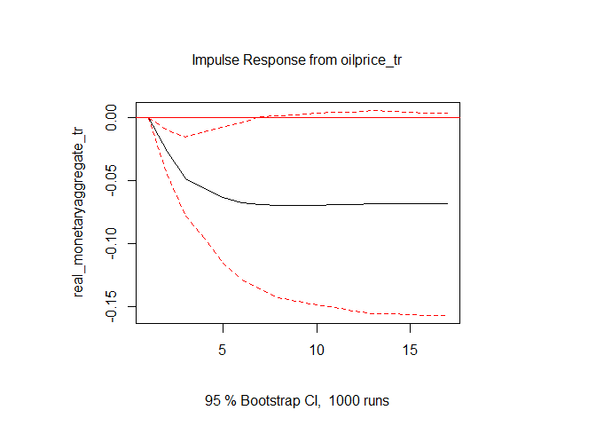
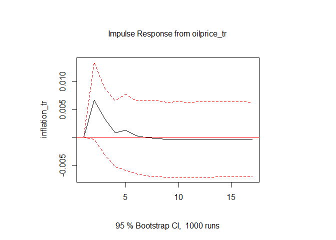
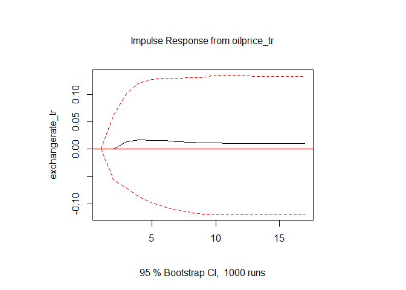

``` r
library(pacman)
pacman::p_load(fredr, tidyverse, lubridate, tsibble, dplyr, tseries, grid,gridExtra, sparsevar, tsDyn,vars)
```

# Johansen’s Methodology for Modeling Cointegration

1.  Select the specification of the deterministic component. Here the
    **Φ**<sub>*t*</sub>**D**<sub>*t*</sub> = **μ**<sub>*t*</sub> = **μ**<sub>0</sub> + **μ**<sub>1</sub>*t*
    term contains all deterministic parts, i.e. constants and trends.
2.  Pre-test the variables to conclude that they are (or may be) *I*(1).
3.  Estimate the unrestricted VAR in levels and check the adequacy of
    the model specification.
4.  Impose the number of cointegrating relationships *r* and execute
    normalization as necessary.
5.  Estimate the resulting (reduced-rank) cointegrated VECM, interpret
    the economic dynamics of the model, and test further hypothesized
    restrictions.

## Step 1: Select the specification of the deterministic component.

## Pre-test the variables to conclude that they are (or may be) *I*(1)

### Augmented Dickey-Fuller (ADF) test for unit roots

### Augmented Dickey-Fuller (ADF) test for order of integration

## Estimate the unrestricted VAR in levels and check the adequacy of the model specification.

### Determine the order of lag

### Check the model specification adequacy of the estimated unrestricted VAR in levels

A critical point is to test that errors are white noise. The Johansen
Method is a ML method, i.e. limiting distributions are derived assuming
normal errors: 1.Robust to some deviations: some non-normality,
heteroscedasticity 2.Requires: i.i.d. errors with finite variance
3.Hence the following is unacceptable: autocorrelated residuals,
time-varying parameters, structural breaks

## Impose the number of cointegrating relationships *r* and execute normalization as necessary.

### Determine the number of cointegrating relationships

    ## 
    ## ###################### 
    ## # Johansen-Procedure # 
    ## ###################### 
    ## 
    ## Test type: maximal eigenvalue statistic (lambda max) , with linear trend in cointegration 
    ## 
    ## Eigenvalues (lambda):
    ## [1]  4.631752e-01  3.704541e-01  2.047458e-01  1.023403e-01  7.418402e-02
    ## [6]  3.460448e-02 -2.531053e-17
    ## 
    ## Values of teststatistic and critical values of test:
    ## 
    ##           test 10pct  5pct  1pct
    ## r <= 5 |  3.31 10.49 12.25 16.26
    ## r <= 4 |  7.25 16.85 18.96 23.65
    ## r <= 3 | 10.15 23.11 25.54 30.34
    ## r <= 2 | 21.53 29.12 31.46 36.65
    ## r <= 1 | 43.50 34.75 37.52 42.36
    ## r = 0  | 58.48 40.91 43.97 49.51
    ## 
    ## Eigenvectors, normalised to first column:
    ## (These are the cointegration relations)
    ## 
    ##                              realGDP_tr.l2 oilprice_tr.l2 interestrate_tr.l2
    ## realGDP_tr.l2                  1.000000000     1.00000000         1.00000000
    ## oilprice_tr.l2                 0.763634082    -0.58920988         1.46601983
    ## interestrate_tr.l2             0.277688629    -0.26340893        -0.03857062
    ## inflation_tr.l2              -58.946031499  -245.83353151       -33.75448549
    ## exchangerate_tr.l2            -0.111833914     2.37137185         1.03272447
    ## real_monetaryaggregate_tr.l2   4.137390205    -6.57324243         1.61228567
    ## trend.l2                       0.003677282    -0.05377991        -0.02079943
    ##                              inflation_tr.l2 exchangerate_tr.l2
    ## realGDP_tr.l2                    1.000000000        1.000000000
    ## oilprice_tr.l2                   0.045758953        0.101796257
    ## interestrate_tr.l2              -0.004059331        0.004120445
    ## inflation_tr.l2                 -2.266938435       -3.390286713
    ## exchangerate_tr.l2               0.131682987       -0.545427381
    ## real_monetaryaggregate_tr.l2     0.155087829        0.409547887
    ## trend.l2                        -0.009691013       -0.008340240
    ##                              real_monetaryaggregate_tr.l2     trend.l2
    ## realGDP_tr.l2                                1.0000000000  1.000000000
    ## oilprice_tr.l2                              -0.0269817681  0.023064592
    ## interestrate_tr.l2                          -0.0009497466 -0.005639033
    ## inflation_tr.l2                             -0.3678260948  0.903515358
    ## exchangerate_tr.l2                          -0.0342136967 -0.240791869
    ## real_monetaryaggregate_tr.l2                -0.3708263246 -0.163842395
    ## trend.l2                                    -0.0075315952 -0.005815555
    ## 
    ## Weights W:
    ## (This is the loading matrix)
    ## 
    ##                             realGDP_tr.l2 oilprice_tr.l2 interestrate_tr.l2
    ## realGDP_tr.d                 -0.006692660   0.0021656240        0.001295944
    ## oilprice_tr.d                -0.020384906   0.0231828697       -0.198494732
    ## interestrate_tr.d            -1.821128427  -0.1779003147       -0.383745124
    ## inflation_tr.d                0.002603462   0.0017484418       -0.002423107
    ## exchangerate_tr.d            -0.015658917   0.0005672215       -0.028352734
    ## real_monetaryaggregate_tr.d  -0.010660404   0.0010482430        0.007621622
    ##                             inflation_tr.l2 exchangerate_tr.l2
    ## realGDP_tr.d                    -0.02902355        0.002624882
    ## oilprice_tr.d                   -0.05383081       -0.296745150
    ## interestrate_tr.d                9.43649506        0.534919291
    ## inflation_tr.d                   0.02159390       -0.003472338
    ## exchangerate_tr.d               -0.05963375        0.112601255
    ## real_monetaryaggregate_tr.d     -0.00364360       -0.002932025
    ##                             real_monetaryaggregate_tr.l2      trend.l2
    ## realGDP_tr.d                                -0.014835026 -3.014385e-14
    ## oilprice_tr.d                                0.033543550 -1.019485e-12
    ## interestrate_tr.d                           -2.682954851 -5.183597e-12
    ## inflation_tr.d                              -0.004212552 -2.569939e-14
    ## exchangerate_tr.d                            0.032539549  6.225732e-13
    ## real_monetaryaggregate_tr.d                  0.029081460 -4.701294e-14

### Esitmate the cointegrating relationships

    ## #############
    ## ###Model VECM 
    ## #############
    ## Full sample size: 96     End sample size: 93
    ## Number of variables: 6   Number of estimated slope parameters 84
    ## AIC -3899.698    BIC -3666.699   SSR 99.45873
    ## Cointegrating vector (estimated by ML):
    ##    realGDP_tr  oilprice_tr interestrate_tr inflation_tr exchangerate_tr
    ## r1          1 8.673617e-19     -0.02157623     15.81735     0.007108329
    ## r2          0 1.000000e+00      0.53085177   -154.53338    -0.075334494
    ##    real_monetaryaggregate_tr      const        trend
    ## r1                0.07161396  -9.064503 -0.009067186
    ## r2                6.55223919 -23.748493  0.022375598
    ## 
    ## 
    ##                                    ECT1                ECT2               
    ## Equation realGDP_tr                -0.0472(0.0112)***  -0.0044(0.0014)**  
    ## Equation oilprice_tr               0.1299(0.3109)      0.0156(0.0376)     
    ## Equation interestrate_tr           9.0708(2.5279)***   -0.4180(0.3055)    
    ## Equation inflation_tr              0.0097(0.0078)      0.0023(0.0009)*    
    ## Equation exchangerate_tr           -0.0281(0.0718)     -0.0098(0.0087)    
    ## Equation real_monetaryaggregate_tr -0.0630(0.0198)**   -0.0099(0.0024)*** 
    ##                                    realGDP_tr -1       oilprice_tr -1     
    ## Equation realGDP_tr                0.2514(0.0972)*     -0.0061(0.0047)    
    ## Equation oilprice_tr               3.6412(2.7014)      0.2547(0.1314).    
    ## Equation interestrate_tr           67.5315(21.9660)**  0.9112(1.0681)     
    ## Equation inflation_tr              0.0993(0.0677)      0.0077(0.0033)*    
    ## Equation exchangerate_tr           -0.8592(0.6243)     -0.0090(0.0304)    
    ## Equation real_monetaryaggregate_tr -0.3868(0.1717)*    -0.0156(0.0083).   
    ##                                    interestrate_tr -1  inflation_tr -1      
    ## Equation realGDP_tr                0.0025(0.0006)***   0.0355(0.2124)       
    ## Equation oilprice_tr               0.0094(0.0175)      -10.9325(5.9008).    
    ## Equation interestrate_tr           -0.1723(0.1419)     -165.7891(47.9816)***
    ## Equation inflation_tr              0.0004(0.0004)      -0.5781(0.1479)***   
    ## Equation exchangerate_tr           0.0036(0.0040)      1.7926(1.3637)       
    ## Equation real_monetaryaggregate_tr -0.0012(0.0011)     0.2904(0.3750)       
    ##                                    exchangerate_tr -1 
    ## Equation realGDP_tr                0.0162(0.0175)     
    ## Equation oilprice_tr               -0.8826(0.4864).   
    ## Equation interestrate_tr           1.6099(3.9549)     
    ## Equation inflation_tr              -0.0138(0.0122)    
    ## Equation exchangerate_tr           0.4598(0.1124)***  
    ## Equation real_monetaryaggregate_tr 0.0221(0.0309)     
    ##                                    real_monetaryaggregate_tr -1
    ## Equation realGDP_tr                -0.0665(0.0653)             
    ## Equation oilprice_tr               -2.9863(1.8128)             
    ## Equation interestrate_tr           -6.7323(14.7403)            
    ## Equation inflation_tr              0.0320(0.0454)              
    ## Equation exchangerate_tr           -0.1821(0.4189)             
    ## Equation real_monetaryaggregate_tr 0.4223(0.1152)***           
    ##                                    realGDP_tr -2        oilprice_tr -2     
    ## Equation realGDP_tr                0.2408(0.0813)**     0.0099(0.0045)*    
    ## Equation oilprice_tr               -1.8341(2.2586)      -0.3019(0.1258)*   
    ## Equation interestrate_tr           15.8871(18.3658)     -1.1646(1.0232)    
    ## Equation inflation_tr              -0.0354(0.0566)      -0.0056(0.0032).   
    ## Equation exchangerate_tr           0.8107(0.5220)       -0.0185(0.0291)    
    ## Equation real_monetaryaggregate_tr -0.1210(0.1435)      -0.0024(0.0080)    
    ##                                    interestrate_tr -2  inflation_tr -2      
    ## Equation realGDP_tr                -0.0009(0.0006)     -0.2119(0.1722)      
    ## Equation oilprice_tr               -0.0055(0.0165)     1.5462(4.7827)       
    ## Equation interestrate_tr           -0.2742(0.1341)*    -25.2883(38.8901)    
    ## Equation inflation_tr              -0.0004(0.0004)     -0.1895(0.1199)      
    ## Equation exchangerate_tr           -0.0004(0.0038)     1.0043(1.1053)       
    ## Equation real_monetaryaggregate_tr 0.0015(0.0010)      0.3956(0.3039)       
    ##                                    exchangerate_tr -2 
    ## Equation realGDP_tr                0.0086(0.0181)     
    ## Equation oilprice_tr               0.1789(0.5029)     
    ## Equation interestrate_tr           0.7781(4.0894)     
    ## Equation inflation_tr              0.0060(0.0126)     
    ## Equation exchangerate_tr           -0.0418(0.1162)    
    ## Equation real_monetaryaggregate_tr 0.0236(0.0320)     
    ##                                    real_monetaryaggregate_tr -2
    ## Equation realGDP_tr                0.0232(0.0619)              
    ## Equation oilprice_tr               2.4215(1.7189)              
    ## Equation interestrate_tr           -9.6564(13.9770)            
    ## Equation inflation_tr              0.0714(0.0431)              
    ## Equation exchangerate_tr           -0.2954(0.3973)             
    ## Equation real_monetaryaggregate_tr 0.0375(0.1092)

### Construct the (6x6) long-run impact matrix *Π* and specify the restricted B matrix

    ##             [,1]         [,2]        [,3]         [,4]          [,5]
    ## [1,] -0.04410625 -0.000462459 0.000000000  0.008050753  0.0000000000
    ## [2,]  0.00000000  0.046860532 0.094125049 54.733081775 -0.0790338175
    ## [3,]  0.00000000  0.000000000 0.001295944  0.094236194  0.0006885841
    ## [4,]  0.00000000  0.000000000 0.000000000 -0.048952046 -0.0012074764
    ## [5,]  0.00000000  0.000000000 0.000000000  0.000000000 -0.0614158076
    ## [6,]  0.00000000  0.000000000 0.000000000  0.000000000  0.0000000000
    ##               [,6]
    ## [1,]  0.0000000000
    ## [2,]  0.0891814018
    ## [3,]  0.0050021500
    ## [4,]  0.0004609080
    ## [5,] -0.0029992261
    ## [6,] -0.0009050643

    ##             Estimate  Std. Error   t value    Pr(>|t|)
    ## Estimate    6.931416  1.85974271 3.6866579 -0.17793701
    ## Std. Error  1.859743  0.51607620 1.0251883 -0.03700606
    ## t value     3.686658  1.02518834 6.5489288  0.20260518
    ## Pr(>|t|)   -0.177937 -0.03700606 0.2026052  0.08479717

``` r
 vecm.fevd <- fevd(VECM_levels) #forecast error variance decomposition
 vecm.norm <- normality.test(VECM_levels)
 vecm.arch <- arch.test(VECM_levels)
 vecm.serial <- serial.test(VECM_levels)
```

We then obtain a single entry for each row, which we can create our
short-run error vector from.

``` r
ErrorVector_U <- c(0.0001328802, 0.07138726, 2.804883e-05, 0.753182, 0.01135468,  0.02108534)
```


